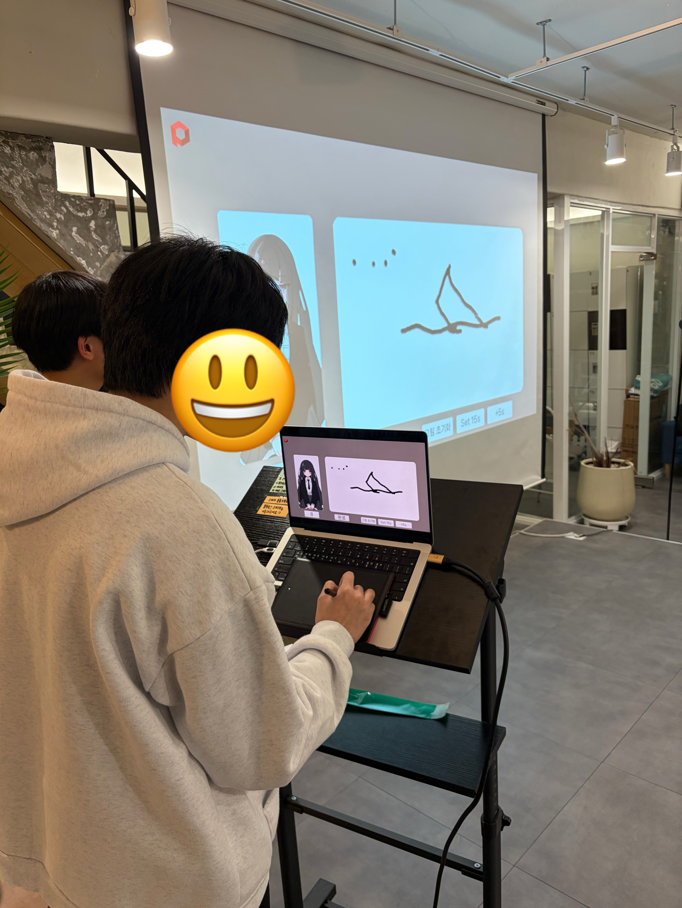
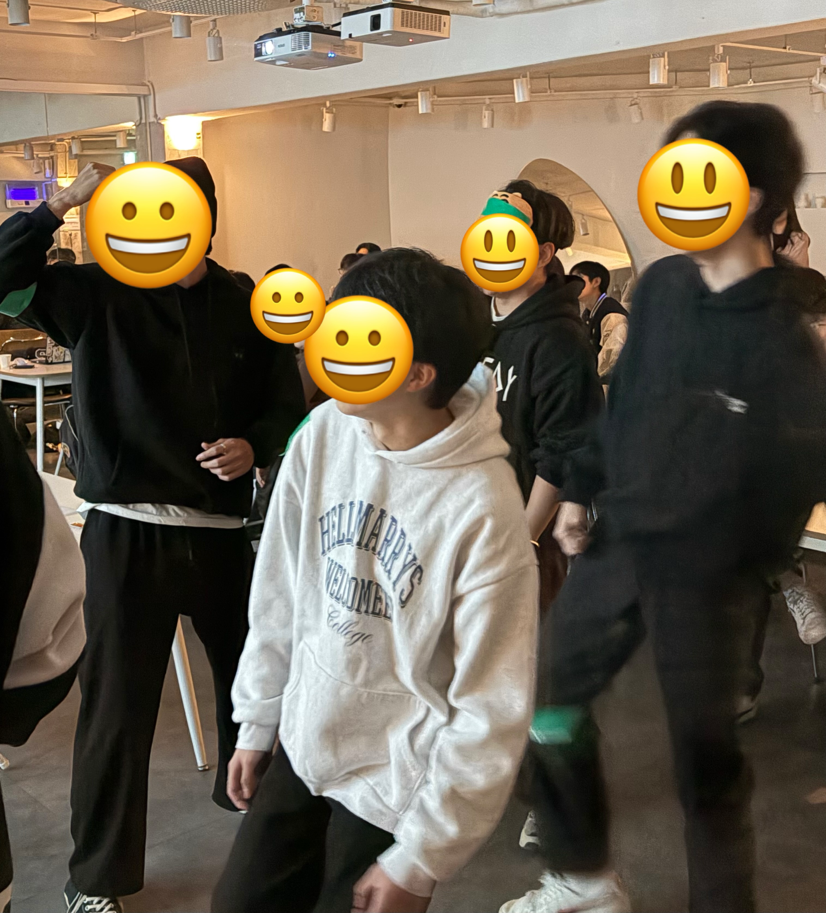
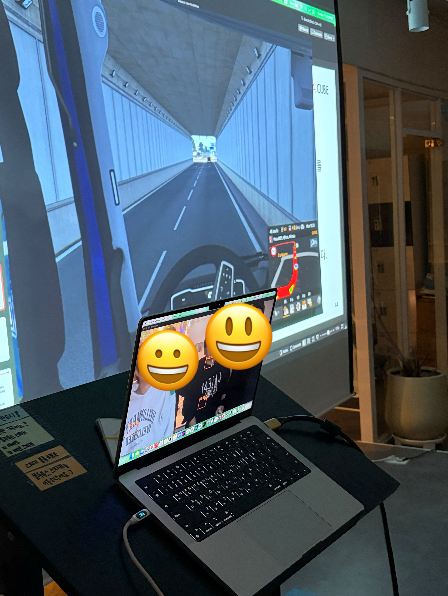
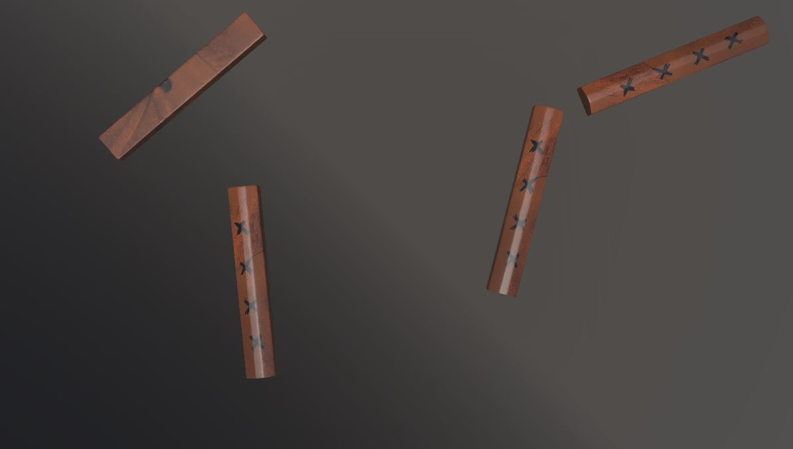

# 2025 가을워크숍 게임

## 01 : AI 그림 맞추기

이 프로젝트는 유저가 그림을 그리면 AI가 무엇을 그렸는지 맞추는 게임입니다. 
프로젝트 활용 방안입니다: 팀원 중 한명이 그림을 그리면 다른 팀원들이 무엇을 그렸는지 맞추고 맞춘 인원수만큼 점수를 획득하지만, 만약 AI가 맞췄다면 점수를 획득하지 못합니다.

### 주요 기능
- 유니티의 Texture2D를 통해 그림판 구현
- OpenAI API 이미지 요청

### 실행
- 유니티 6000.0.32f1 버전에서 제작되었습니다
- 실행을 위해서는 OpenAI API key가 필요합니다.
- 프로젝트 루트에 `.env` 파일을 생성하고 아래와 같이 작성하세요:
  ```
  OPENAI_API_KEY=YOUR_API_KEY_HERE
  ```

### 게임 플레이 사례

판도라큐브 부원들이 가을 워크숍에 AI 그림 맞추기 게임을 즐기고 있는 모습입니다.




## 02 : 모션인식 게임

이 프로젝트는 웹캠에서 특정 색을 추적해 화면의 구역(ROI, Region of Interest)에 들어오면 미리 정의한 키 입력을 눌러 주는 헬퍼입니다. 팀원끼리 초록 테이프 등을 몸에 붙이고 게임을 함께 조작하는 파티 게임으로 활용할 수 있습니다.

### 주요 기능
- OpenCV 로 카메라 프레임을 받아 좌우 반전·마스킹·ROI 오버레이를 수행
- HSV 범위 기반 녹색 마스크 생성 및 모폴로지 정제로 노이즈 감소
- ROI 편집 모드 + 트랙바 설정 패널로 위치/크기/민감도/키를 실시간 조정
- ROI 활성/비활성 프레임 수를 추적해 Debounce 된 키 입력 발생
- `roi_config*.json` 으로 다양한 게임/프로필 레이아웃 저장 및 로드

### 요구 사항
- Python 3.9+
- macOS, Windows 또는 Linux (웹캠, 키보드 제어 권한 필요)
- pip 로 설치 가능한 패키지
  - `opencv-python`
  - `numpy`
  - `pynput`

### 설치 및 실행
```bash
# 1) 가상환경(옵션)
python -m venv .venv
source .venv/bin/activate  # Windows PowerShell: .\.venv\Scripts\Activate.ps1

# 2) 의존성 설치
pip install opencv-python numpy pynput

# 3) 앱 실행
python app.py
```

> **Windows**: 최초 실행 시 키보드 제어 권한을 허용해야 합니다.  
> **macOS**: 보안 및 개인정보 보호 > 손쉬운 사용에서 터미널/IDE 에 대한 접근성 권한을 부여하세요.

### ROI 구성
- `roi_config.json` 은 기본 레이아웃이며, `roi_config_eurotruck.json` 처럼 게임별 사본을 만들어 둘 수 있습니다.
- 앱 실행 → `E` 로 편집 모드 → 마우스로 ROI 이동 또는 Settings 패널(자동 팝업)에서
  - ROI 선택, 민감도(Sensitivity), Width/Height, Key 를 조정
  - `S` 키로 저장하면 JSON 이 현재 프레임 크기에 맞춰 덮어쓰기 됩니다.
- 다른 설정 파일을 쓰고 싶다면 `ROIManager(config_path="roi_config_eurotruck.json")` 로 변경하거나 symlink/복사 후 덮어쓰기 하세요.

### 사용 중 단축키
- `Q`: 앱 종료
- `E`: ROI 편집 모드 토글
- `S`: ROI 설정 저장
- `M`: 마스크 창 토글
- `T`: HSV 튜너(범위 슬라이더) 토글

### 문제 해결 팁
- 인식이 들쭉날쭉하면 조명 환경에 맞춰 HSV 튜너(`T`)로 녹색 범위를 재조정, 혹은 ROI 편집 모드에서 민감도를 높일 수 있습니다.
- 키 입력이 전달되지 않으면 `pynput` 를 다시 설치하거나 OS 접근성/키보드 제어 권한을 확인하세요.


### 게임 플레이 사례

판도라큐브 부원들이 가을 워크숍에 모션 인식 게임을 즐기고 있는 모습입니다.


유로트럭과 연동하여 4인 협동 운전 게임을 했습니다.


## 03 : 윷 던지기

윷 던지기 프로그램의 빌드 파일입니다. 랜덤으로 윷을 던지고 결과를 판정하여 알려줍니다. .exe 실행 파일이 있습니다.

### 스크린샷
